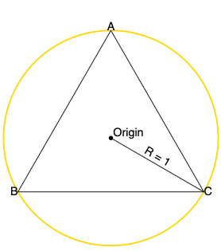

# D3 Ternary Plot

d3-ternary is a JavaScript library and D3.js module that makes it easy to create ternary plots, its API exposes configurable functions in the manner of other D3 modules. Ternary plots depict three-component systems, each side corresponds to an individual component.

[Try d3-ternary in your browser on Observable](https://observablehq.com/@julesblm/introducing-d3-ternary-plot?collection=@julesblm/ternary-plots). View this [Observable notebook collection](https://observablehq.com/collection/@julesblm/ternary-plots) for examples.


## Installing

TODO after publishing to npm and adding release to GitHub

## API Reference

### `barycentric()`

**barycentric**() [<>](https://github.com/davenquinn/d3-ternary/blob/dev-new-version/src/barycentric.js#L4)

Constructs a new default ternary/barycentric converter. By default, it makes an equilateral triangle on the unit circle centered the origin.

[#](#baryCentricConvertDoc) _barycentric_(_data_) [<>](https://github.com/davenquinn/d3-ternary/blob/dev-new-version/src/barycentric.js#L25)

Computes `[x,y]` coordinates from a ternary values (a single three-element array). Note that the [x, y] coordinates here are unscaled (radius of 1). All values are [normalized](#baryCentricNormalizeDoc) by default.

[#](#baryCentricInvertDoc) _barycentric_.**invert**(_coordinates_) [<>](https://github.com/davenquinn/d3-ternary/blob/dev-new-version/src/barycentric.js#L35)

Computes ternary values from coordinates (a two-element array `[x, y]`). Note that the [x, y] coordinates here are unscaled i.e. a radius of 1.


[#](#baryCentricADoc) _barycentric_.**a**([_a_]) [<>](https://github.com/davenquinn/d3-ternary/blob/dev-new-version/src/barycentric.js#L56)

If `a` is specified, sets the a-accessor to the specified function and returns this barycentric converter. If a is not specified, returns the current a-value accessor, which defaults to:

```javascript
const a = (d) => d[0];
```

[#](#baryCentricBDoc) _barycentric_.**b**([_b_]) [<>](https://github.com/davenquinn/d3-ternary/blob/dev-new-version/src/barycentric.js#L60)

If `b` is specified, sets the b-accessor to the specified function and returns this barycentric converter. If a is not specified, returns the current b-value accessor, which defaults to:

```javascript
const b = (d) => d[1];
```

[#](#baryCentricCDoc) _barycentric_.**c**([_c_]) [<>](https://github.com/davenquinn/d3-ternary/blob/dev-new-version/src/barycentric.js#L64)

If `c` is specified, sets the c-accessor to the specified function and returns this barycentric converter. If a is not specified, returns the current c-value accessor, which defaults to:

```javascript
const c = (d) => d[2];
```


[#](#baryCentricNormalizeDoc) _barycentric_.**normalize**(_ternaryData_) [<>](https://github.com/davenquinn/d3-ternary/blob/dev-new-version/src/barycentric.js#L68)

Computes normalized ternary values by summing and taking proportions of ternary data using the value accessors.

[#](#baryCentricVerticesDoc) _barycentric_.**vertices**([_vertices_]) [<>](https://github.com/davenquinn/d3-ternary/blob/dev-new-version/src/barycentric.js#70)

If `vertices` is specified, sets the vertices to the specified array and returns this barycentric converter. If `vertices` is not specified, returns the current vertices, which defaults to the vertices of an equilateral triangle with radius 1 with angles -90°, 150°, 30°.


The following diagram makes it more clear



### `ternaryPlot()`

**ternaryPlot**(_barycentric_) [<>](https://observablehq.com/@julesblm/)

Constructs a new default ternary plot generator with the default options.

#### Utility methods

[#](#densityPlotDensityDoc) _ternaryPlot_.**invert**(_coordinates_) [<>](https://github.com/davenquinn/d3-ternary/blob/src/ternaryPlot.js#L365)

Computes ternary values from `[x, y]` coordinates that are scaled by the radius. Unlike the _barycentric_.[invert()](#baryCentricInvertDoc) method this method takes the plot radius into account. Note that for inverting mouse positions, the ternary plot should centered at the origin of the containing SVG element.

[#](#tod) _ternaryPlot_.**convert**(_data_) [<>](https://github.com/davenquinn/d3-ternary/blob/src/ternaryPlot.js#L359)

Computes `[x, y]` coordinates that are scaled by the plot radius from ternary data. Unlike the _barycentric_.[convert()](#baryCentricInvertDoc) method, this method takes the plot radius into account.


#### Configuration methods

[#](#ternaryPlotRadiusDoc) _ternaryPlot_.**radius**([_radius_]) [<>](https://github.com/davenquinn/d3-ternary/blob/dev-new-version/src/ternaryPlot.js#L330)

If _radius_ is specified, sets the radius of the ternary plot to the specified number. If \_radius_e is not specified, returns the current radius, which defaults to 500 (px).

[#](#ternaryPlotDomainsDoc) _ternaryPlot_.**domains**([_domains_]) [<>](https://github.com/davenquinn/d3-ternary/blob/dev-new-version/src/ternaryPlot.js#L180)

If _domains_ is specified, sets the domains of the ternary plot to the specified domains in order `[A, B, C]` and checks if the supplied domains are reversed. If this is the case, [`reverseVertices()`](#ternaryPlotReverseVertices) is called. The scale and translation offset associated with the domains are [applied](#ternarPlotTransformDoc) to correctly scale and translate the plot, last it returns the ternary plot.
If _domains_ is not specified, returns the current domains, which defaults to `[[0, 1], [0, 1], [0, 1]]`.

To set domains without these extra checks use _ternaryPlot_.[setDomains(_domains_)](#ternaryPlotSetDomains).

[#](#ternaryPlotVerticesDoc) _ternaryPlot_.**vertices**(_vertices_) [<>](https://github.com/davenquinn/d3-ternary/blob/dev-new-version/src/ternaryPlot.js#L112)

If _vertices_ is specified, unscales _vertices_ and sets the vertices of the _barycentric()_ function passed to _ternaryPlot()_. If _vertices_ is not specified, return the current scaled vertices.

##### Styling

[#](#ternaryPlotLabelsDoc) _ternaryPlot_.**labels**([_labels_]) [<>](https://github.com/davenquinn/d3-ternary/blob/dev-new-version/src/ternaryPlot.js#L301)

If _labels_ is specified, sets the axis labels to the labels in order `[A, B, C]` and returns the ternary plot. If _labels_ is not specified, returns the current labels, which defaults to `[A, B, C]`.

[#](#ternaryPlotLabelAnglesDoc) _ternaryPlot_.**labelAngles**([_angles_]) [<>](https://github.com/davenquinn/d3-ternary/blob/dev-new-version/src/ternaryPlot.js#L307)

If _angles_ is specified, sets the angles of the axis labels to the specified angles in order `[A, B, C]` and returns the ternary plot. If _angles_ is not specified, returns the current label angles, which defaults to `[0, 60, -60]`

[#](#ternaryPlotLabelOffsetsDoc) _ternaryPlot_.**labelOffsets**([_offsets_]) [<>](https://github.com/davenquinn/d3-ternary/blob/dev-new-version/src/ternaryPlot.js#L316)

The label offset is the extra distance of the label to the vertex. If _offsets_ is specified, sets the axis label offsets to the specified angles in order `[A, B, C]` and returns the ternary plot. If _offsets_ is not specified, returns the current label offsets, which defaults to `[45, 45, 45]\

[#](#ternaryPlotGridLineCountsDoc) _ternaryPlot_.**gridLineCounts**([_counts_]) [<>](https://github.com/davenquinn/d3-ternary/blob/dev-new-version/src/ternaryPlot.js#220)

If _counts_ is specified and an array, sets the grid line counts of the axes to the specified counts in order `[A, B, C]` and returns the ternary plot. If _counts_ is a number, sets the grid line counts of all axes to _counts_. If counts is not specified, returns the current counts, which defaults to `[20, 20, 20]`.

[#](#ternaryPlotTickAnglesDoc) _ternaryPlot_.**tickAngles**([_angles_]) [<>](https://github.com/davenquinn/d3-ternary/blob/dev-new-version/src/ternaryPlot.js#256)

If _angles_ is specified, sets the angle axis ticks to the specified angles in order `[A, B, C]` and returns the ternary plot. If _angles_ is not specified, returns the current tick angles, which defaults to `[0, 60, -60]`.

[#](#ternaryPlotTickCountsDoc) _ternaryPlot_.**tickCounts**([_counts_]) [<>](https://github.com/davenquinn/d3-ternary/blob/dev-new-version/src/ternaryPlot.js#265)

If _counts_ is specified and an array, sets the tick counts of the axes to the specified counts in order `[A, B, C]` and returns the ternary plot. If _counts_ is a number, sets the tick counts of all axes to _counts_. If _counts_ is not specified, returns the current counts, which defaults to `[10, 10, 10]`.

[#](#ternaryPlotTickAnchorsDoc) _ternaryPlot_.**tickTextAnchors**([_textAnchors_]) [<>](https://github.com/davenquinn/d3-ternary/blob/dev-new-version/src/ternaryPlot.js#292)

If _textAnchors_ is specified, sets the axis tick [text-anchor](https://developer.mozilla.org/en-US/docs/Web/SVG/Attribute/text-anchor) to the specified text-anchors in order `[A, B, C]` and returns the ternary plot. If _textAnchors_ is not specified, returns the current tick text-anchors, which defaults to `["start", "start", "end"]`.

[#](#ternaryPlotTickSizesDoc) _ternaryPlot_.**tickSizes**([_sizes_]) [<>](https://github.com/davenquinn/d3-ternary/blob/dev-new-version/src/ternaryPlot.js#277)

If _sizes_ is specified and an array, sets the axis tick sizes to the specified tick sizes in order `[A, B, C]` and returns the ternary plot. If _sizes_ is a number, sets the tick sizes of all axes to _sizes_. If _sizes_ is not specified, returns the current tick sizes, which defaults to `[6, 6, 6]`.

[#](#ternaryPlotTickFormatDoc) _ternaryPlot_.**tickFormat**([_format_]) [<>](https://github.com/davenquinn/d3-ternary/blob/dev-new-version/src/ternaryPlot.js#288)

If _format_ is specified, sets the tick format. _format_ can either be a [format specifier string](https://github.com/d3/d3-format#format) that is passed to [`d3.tickFormat()`](https://github.com/d3/d3-scale/blob/master/README.md#tickFormat). To implement your own tick format function, pass a custom formatter function, for example `x => String(x.toFixed(1))`. If _format_ is not specified, returns the current tick sizes, which defaults to `"%"`, meaning ticks are formatted as percentages.

### The functions that actually return the plot

[#](#ternaryPlotGridLinesDoc) _ternaryPlot_.**gridLines**() [<>](https://github.com/davenquinn/d3-ternary/blob/dev-new-version/src/ternaryPlot.js#209)

Generates and return an array of arrays containing each grid line objects. Each array contains `axis.gridLineCount` elements of two-element arrays with the start- and end coordinates of the grid line in two-element arrays.

Grid lines are generated using [d3._scale_.ticks()](https://github.com/d3/d3-scale/blob/master/README.md#continuous_ticks). The specified count is only a **hint**; the scale may return more or fewer values depending on the domain.

[#](#ternaryPlotTicksDoc) _ternaryPlot_.**ticks**() [<>](https://github.com/davenquinn/d3-ternary/blob/dev-new-version/src/ternaryPlot.js#234)

Generates and return an array for each axis, which contains an array with axis tick objects.
Each tick object contains the following properties

- `tick`: The tick text
- `position`: An array of x, y coords
- `angle`: The tick rotation
- `size`: The length of the tick

Ticks are generated using [d3._scale_.ticks()](https://github.com/d3/d3-scale/blob/master/README.md#continuous_ticks). The specified count is only a **hint**; the scale may return more or fewer values depending on the domain.

[#](#ternaryPlotAxisLabelsDoc) _ternaryPlot_.**axisLabels**(_[{center: false}]_) [<>](https://github.com/davenquinn/d3-ternary/blob/dev-new-version/src/ternaryPlot.js#134)

Generates and return an array containing axis label objects. Each axis label object contains the following properties.

- `position`: an array of [x,y] coords
- `labelAngle`: the rotation of the axis label
- `label`: The axis label

Takes an optional configuration object that specifies whether axis labels should be placed at the center of the axis, the default is `false`.

```javascript
ternaryPlot.axisLabels({ center: true });
```

[#](#ternaryPlotTriangleDoc) _ternaryPlot_.**triangle**() [<>](todo)

Returns an [SVG path command](https://developer.mozilla.org/en-US/docs/Web/SVG/Attribute/d) for a the outer triangle. This is used for the bounds of the ternary plot and its [clipPath](https://developer.mozilla.org/en-US/docs/Web/SVG/Element/clipPath).

### Hairy methods that handle zooming and interactivity

Best not to touch these really.

[#](#ternaryPlotTranslateDoc) _ternaryPlot_.**translate**([scale]) [<>](https://github.com/davenquinn/d3-ternary/blob/dev-new-version/src/ternaryPlot.js#353)

If translate is specified, sets the plot’s translation offset to the specified two-element array `[tx, ty]`. Note that these are **unscaled by the radius**. Then it applies the transform and returns the ternary plot. If translate is not specified, returns the current translation offset which defaults to `[0, 0]`.

Note when setting the translation, the offsets **should not** be scaled by the plot radius.

[#](#ternaryPlotScaleDoc) _ternaryPlot_.**scale**(_[scale]_) [<>](https://github.com/davenquinn/d3-ternary/blob/src/ternaryPlot.js#L346)

If _scale_ is specified, sets the plot’s scale factor to the specified value, applies the transform and returns the plot. If _scale_ is not specified, returns the current scale factor, which defaults to `1`.

The scale factor corresponds inversely to the domain length. For example a domains of `[[0, 0.5], [0, 0.5], [0.5, 1]` corresponds to a scale of 2.

[#](#ternaryPlotTransformDoc) _ternaryPlot_.**transform**() [<>](https://github.com/davenquinn/d3-ternary/blob/src/ternaryPlot.js#L373)

Applies the plot's scale factor and translation to the plot. Before scale and translation are applied, they are tested if they are within bounds, if not a correction is applied. At last, returns the ternary plot.

[#](#ternaryPlotReverseVerticesDoc) _ternaryPlot_.**reverseVertices**() [<>](https://github.com/davenquinn/d3-ternary/blob/src/ternaryPlot.js#L162)

Swaps vertices so reversed domains are displayed correctly. _ternaryPlot_.[domains()](#ternaryPlotDomainsDoc) checks wether the domains are reversed and calls this method if so. You'll rarely need to call this method directly.

[#](#ternaryPlotTransformFromDomainsDoc) _ternaryPlot_.**transformFromDomains**(_domains_) [<>](https://github.com/davenquinn/d3-ternary/blob/src/ternaryPlot.js#L443)

Computes the scale and translation that match the passed _domains_ and return a transform object containing. This is used to sync the zoom and pan of the plot to the specified domains set by [.domains()](ternaryPlotDomainsDoc). You'll rarely need to call this method directly.

Note that the translation returned here is unscaled by radius.

[#](#ternaryPlotDomainsFromVerticesDoc) _ternaryPlot_.**domainsFromVertices**() [<>](https://github.com/davenquinn/d3-ternary/blob/src/ternaryPlot.js#L478)

Computes and returns the domains corresponding to current transform. This is used for syncing domains while zooming and panning.

[#](#ternaryPlotSetDomainsDoc) _ternaryPlot_.**setDomains**(domains) [<>](https://github.com/davenquinn/d3-ternary/blob/src/ternaryPlot.js#L152)

Sets the domains in order `[A, B, C]`. This method is needed when setting domains that are returned by _ternaryPlot_.domainsFromVertices() while zooming and panning. Usually _ternaryPlot._[domains()](#ternaryPlotDomainsDoc) is the preferred method for setting domains.

## Future work

- The transform method is hacky, bug-prone piece of work made through trial and error.
- Canvas support
- Support for [ternary binning](https://observablehq.com/@fil/ternary-binning)
- Testing!

## Credits

Several projects have served as a starting point for this
work. Thanks especially to:

## Contributing
