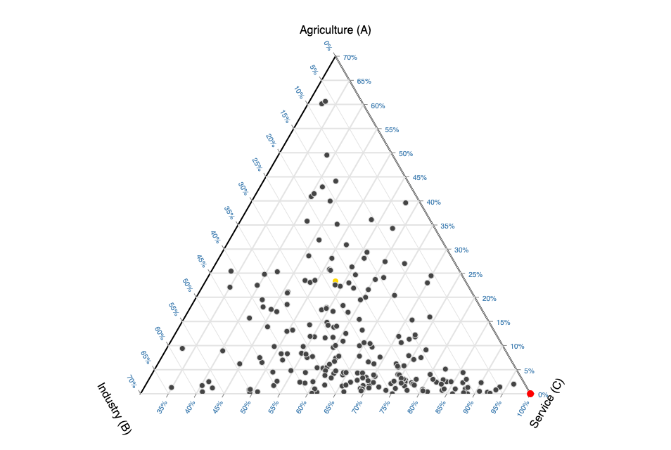

# D3 Ternary Plot

[](https://www.npmjs.com/package/d3-ternary)

d3-ternary is a JavaScript library and [D3.js](https://d3js.org/) module that makes it easy to create ternary plots, its API exposes configurable functions in the manner of other D3 modules.

Ternary plots are a type of triangular diagram that depict components proportions in three-component systems. Each point in the triangle corresponds to a unique composition of those three components.

Try d3-ternary your browser, [view the introductory notebook on Observable](https://observablehq.com/@julesblm/introducing-d3-ternary?collection=@julesblm/ternary-plots) and see the 'Ternary Plots' [notebook collection](https://observablehq.com/collection/@julesblm/ternary-plots) for examples. Or make ternary plots in the browser on [TernaryPlot.com](https://www.ternaryplot.com) which is built using d3-ternary.



## Installing

If you use npm

```bash
npm install d3-ternary
```

For yarn

```bash
yarn add d3-ternary
```

You can also download the [latest release](https://github.com/davenquinn/d3-ternary/releases) on GitHub. For vanilla HTML in modern browsers, import d3-ternary from [Skypack](https://www.skypack.dev/):

```html
<script type="module">

import {barycentric, ternaryPlot} from "https://cdn.skypack.dev/d3-ternary@2";

const b = barycentric();
const t = ternaryPlot(b);

</script>
```

For legacy environments, you can load d3-ternary’s UMD bundle from an npm-based CDN such as [jsDelivr](https://www.google.com/search?q=jsdelvr&oq=jsdelvr&aqs=chrome..69i57.4168j0j7&sourceid=chrome&ie=UTF-8) or [unpkg](https://unpkg.com/); a d3 global is exported:

```html
<script src="https://cdn.jsdelivr.net/npm/d3-array@3"></script>
<script src="https://cdn.jsdelivr.net/npm/d3-scale@4"></script>
<script src="https://cdn.jsdelivr.net/npm/d3-ternary@2"></script>
<script>

const b = d3.barycentric();
const t = d3.ternaryPlot(b)
  
</script>
```

## API Reference

### `barycentric()`

**barycentric**() [<>](https://github.com/davenquinn/d3-ternary/blob/master/src/barycentric.ts#L4)

Constructs a new default ternary converter that converts ternary data to Cartesian coordinates. By default, it makes an equilateral triangle on the unit circle centered at the origin.

[#](#barycentricConvertDoc) _barycentric_(_data_) [<>](https://github.com/davenquinn/d3-ternary/blob/master/src/barycentric.ts#L25)

Computes `[x,y]` coordinates from a ternary values (a single three-element array). Note that the [x, y] coordinates here are unscaled (radius of 1). All values are [normalized](#barycentricNormalizeDoc) by default.

[#](#barycentricInvertDoc) _barycentric_.**invert**(_coordinates_) [<>](https://github.com/davenquinn/d3-ternary/blob/master/src/barycentric.ts#L35)

Computes ternary values from coordinates (a two-element array `[x, y]`). Note that the [x, y] coordinates here are unscaled i.e. a radius of 1.

[#](#barycentricADoc) _barycentric_.**a**([_a_]) [<>](https://github.com/davenquinn/d3-ternary/blob/master/src/barycentric.ts#L56)

If __a__ is specified, sets the a-accessor to the specified function and returns this barycentric converter. If _a_ is not specified, returns the current a-value accessor, which defaults to:

```javascript
const a = (d) => d[0];
```

[#](#barycentricBDoc) _barycentric_.**b**([_b_]) [<>](https://github.com/davenquinn/d3-ternary/blob/master/src/barycentric.ts#L60)

If __b__ is specified, sets the b-accessor to the specified function and returns this barycentric converter. If _b_ is not specified, returns the current b-value accessor, which defaults to:

```javascript
const b = (d) => d[1];
```

[#](#barycentricCDoc) _barycentric_.**c**([_c_]) [<>](https://github.com/davenquinn/d3-ternary/blob/master/src/barycentric.ts#L64)

If _c_ is specified, sets the c-accessor to the specified function and returns this barycentric converter. If _c_ is not specified, returns the current c-value accessor, which defaults to:

```javascript
const c = (d) => d[2];
```

[#](#barycentricNormalizeDoc) _barycentric_.**normalize**(_ternaryData_) [<>](https://github.com/davenquinn/d3-ternary/blob/master/src/barycentric.ts#L68)

Computes normalized ternary values by summing the of ternary data and taking proportions of it using the value accessors.

[#](#barycentricVerticesDoc) _barycentric_.**vertices**([_vertices_]) [<>](https://github.com/davenquinn/d3-ternary/blob/master/src/barycentric.ts#70)

If `vertices` is specified, sets the vertices to the specified array and returns this barycentric converter. If `vertices` is not specified, returns the current vertices, which defaults to the vertices of an equilateral triangle with radius 1 with angles -90°, 150°, 30°.


The following diagram makes it more clear


### `ternaryPlot()`

**ternaryPlot**(_barycentric_) [<>](https://github.com/davenquinn/d3-ternary/blob/master/src/ternaryPlot.ts)

Constructs a new default ternary plot generator with the default options.

[#](#ternaryPlotConvertDoc) _ternaryPlot_(_data_) [<>](https://github.com/davenquinn/d3-ternary/blob/master/src/ternaryPlot.ts#L359)

Computes `[x, y]` coordinates that are scaled by the plot radius from ternary data. Unlike the [_barycentric_](#barycentricConvertDoc) method, this method takes the plot radius into account.

[#](#ternaryPlotInvertDoc) _ternaryPlot_.**invert**(_coordinates_) [<>](https://github.com/davenquinn/d3-ternary/blob/master/src/ternaryPlot.ts#L365)

Computes ternary values from `[x, y]` coordinates that are scaled by the radius. Unlike the _barycentric_.[invert()](#barycentricInvertDoc) method this method takes the plot radius into account. Note that for inverting mouse positions, the ternary plot should centered at the origin of the containing SVG element.

#### Configuration methods


[#](#ternaryPlotRadiusDoc) _ternaryPlot_.**radius**([_radius_]) [<>](https://github.com/davenquinn/d3-ternary/blob/master/src/ternaryPlot.ts#L330)

If _radius_ is specified, sets the radius of the ternary plot to the specified number. If _radius_ is not specified, returns the current radius, which defaults to 300 (px).

[#](#ternaryPlotDomainsDoc) _ternaryPlot_.**domains**([_domains_]) [<>](https://github.com/davenquinn/d3-ternary/blob/master/src/ternaryPlot.ts#L180)


If _domains_ is specified, sets the domains of the ternary plot to the specified domains in order `[A, B, C]` and checks if the supplied domains are reversed. If this is the case, [`reverseVertices()`](#ternaryPlotReverseVerticesDoc) is called. The scale and translation offset associated with the domains are [applied](#ternaryPlotTransformDoc) to correctly scale and translate the plot. At last it returns the ternary plot.
If _domains_ is not specified, returns the current domains, which defaults to `[[0, 1], [0, 1], [0, 1]]`.

To set domains without these extra checks, use _ternaryPlot_.[setDomains(_domains_)](#ternaryPlotSetDomains).

[#](#ternaryPlotVerticesDoc) _ternaryPlot_.**vertices**([_vertices_]) [<>](https://github.com/davenquinn/d3-ternary/blob/master/src/ternaryPlot.ts#L112)

If _vertices_ is specified, unscales _vertices_ and sets the vertices of the _barycentric()_ function passed to _ternaryPlot()_. If _vertices_ is not specified, return the current scaled vertices.

#### Layout methods

[#](#ternaryPlotLabelsDoc) _ternaryPlot_.**labels**([_labels_]) [<>](https://github.com/davenquinn/d3-ternary/blob/master/src/ternaryPlot.ts#L426)

If _labels_ is specified, sets the axis labels to the labels in order of `[A, B, C]` and returns the ternary plot. If _labels_ is not specified, returns the current labels, which defaults to `[`[A, B, C]`]`.

[#](#ternaryPlotLabelAnglesDoc) _ternaryPlot_.**labelAngles**([_angles_]) [<>](https://github.com/davenquinn/d3-ternary/blob/master/src/ternaryPlot.ts#L488)

If _angles_ is specified, sets the angles of the axis labels to the specified angles in order of `[A, B, C]` and returns the ternary plot. If _angles_ is not specified, returns the current label angles, which defaults to `[0, 60, -60]`

[#](#ternaryPlotLabelOffsetsDoc) _ternaryPlot_.**labelOffsets**([_offsets_]) [<>](https://github.com/davenquinn/d3-ternary/blob/master/src/ternaryPlot.ts#L469)

The label offset is the spacing of the label to the vertex in pixels. If _offsets_ is specified and is an array, sets the axis label offsets to the specified angles in order of `[A, B, C]` and returns the ternary plot. If _offsets_ is a number, sets the label offsets of all axes to _offsets_. If _offsets_ is not specified, returns the current label offsets, which defaults to `[45, 45, 45]` px.

[#](#ternaryPlotTickAnglesDoc) _ternaryPlot_.**tickAngles**([_angles_]) [<>](https://github.com/davenquinn/d3-ternary/blob/master/src/ternaryPlot.ts#256)

If _angles_ is specified, sets the angle of the ticks of each axis to the specified angles in order `[A, B, C]` and returns the ternary plot. If _angles_ is not specified, returns the current tick angles, which defaults to `[0, 60, -60]`.

[#](#ternaryPlotTickAnchorsDoc) _ternaryPlot_.**tickTextAnchors**([_textAnchors_]) [<>](https://github.com/davenquinn/d3-ternary/blob/master/src/ternaryPlot.ts#410)

If _textAnchors_ is specified, sets the axis tick [text-anchor](https://developer.mozilla.org/en-US/docs/Web/SVG/Attribute/text-anchor) to the specified text-anchors in order of `[A, B, C]` and returns the ternary plot. If _textAnchors_ is not specified, returns the current tick text-anchors, which defaults to `["start", "start", "end"]`.

[#](#ternaryPlotTickSizesDoc) _ternaryPlot_.**tickSizes**([_sizes_]) [<>](https://github.com/davenquinn/d3-ternary/blob/master/src/ternaryPlot.ts#370)

If _sizes_ is specified and is an array, sets the axis tick sizes to the specified tick sizes in order of `[A, B, C]` and returns the ternary plot. If _sizes_ is a number, sets the tick sizes of all axes to _sizes_. If _sizes_ is not specified, returns the current tick sizes, which defaults to `[6, 6, 6]` (px).

[#](#ternaryPlotTickFormatDoc) _ternaryPlot_.**tickFormat**([_format_]) [<>](https://github.com/davenquinn/d3-ternary/blob/master/src/ternaryPlot.ts#387)

If _format_ is specified, sets the tick format. _format_ can either be a [format specifier string](https://github.com/d3/d3-format#format) that is passed to [`d3.tickFormat()`](https://github.com/d3/d3-scale/blob/master/README.md#tickFormat). To implement your own tick format function, pass a custom formatter function, for example `const formatTick = (x) => String(x.toFixed(1))`. If _format_ is not specified, returns the current tick sizes, which defaults to `"%"`, meaning ticks are formatted as percentages.

#### Plot Methods

[#](#ternaryPlotGridLinesDoc) _ternaryPlot_.**gridLines**() [<>](https://github.com/davenquinn/d3-ternary/blob/master/src/ternaryPlot.ts#209)

Generates and return an array of arrays containing each grid line objects. If counts is not specified, it defaults to 20. *Counts* can be a number or an array of numbers, one for each axis in order of `[`[A, B, C]`]` . Each array contains `counts` elements of two-element arrays with the start- and end coordinates of the grid line in two-element arrays.

Grid lines are generated using [d3._scale_.ticks()](https://github.com/d3/d3-scale/blob/master/README.md#continuous_ticks). The specified count is only a **hint**; the scale may return more or fewer values depending on the domain.

[#](#ternaryPlotTicksDoc) _ternaryPlot_.**ticks**() [<>](https://github.com/davenquinn/d3-ternary/blob/master/src/ternaryPlot.ts#234)

Generates and return an array of tick objects for each axis. If counts is not specified, it defaults to 10. *Counts* can be a number or an array of numbers, one for each axis in order of `[A, B, C]`.
Each tick object contains the following properties

- `tick`: The formatted tick text
- `position`: An array of x, y coords
- `angle`: The tick rotation
- `size`: The length of the tick

Ticks are generated using [d3._scale_.ticks()](https://github.com/d3/d3-scale/blob/master/README.md#continuous_ticks). The specified count is only a **hint**; the scale may return more or fewer values depending on the domain.

[#](#ternaryPlotAxisLabelsDoc) _ternaryPlot_.**axisLabels**(_[{center: false}]_) [<>](https://github.com/davenquinn/d3-ternary/blob/master/src/ternaryPlot.ts#134)

Generates and return an array containing axis label objects. Each axis label object contains the following properties.

- `position`: an array of [x,y] coords
- `labelAngle`: the rotation of the axis label
- `label`: The axis label

Takes an optional configuration object that specifies whether axis labels should be placed at the center of the axis, the default is `false`.

```javascript
ternaryPlot.axisLabels({ center: true });
```

[#](#ternaryPlotTriangleDoc) _ternaryPlot_.**triangle**() [<>](https://github.com/davenquinn/d3-ternary/blob/master/src/ternaryPlot.ts#L330)

Returns an [SVG path command](https://developer.mozilla.org/en-US/docs/Web/SVG/Attribute/d) for a the outer triangle. This is used for the bounds of the ternary plot and its [clipPath](https://developer.mozilla.org/en-US/docs/Web/SVG/Element/clipPath).

#### Methods for handling zooming, panning

These methods are used internally for _ternaryPlot*.**domains()**, and can be used to handle interactivity like zooming and panning. See [Introducing-d3-ternary: Zooming](https://observablehq.com/@julesblm/introducing-d3-ternary?collection=@julesblm/ternary-plots#zooming) for an example of this.
Other than that, best not to touch these really.

[#](#ternaryPlotTranslateDoc) _ternaryPlot_.**translate**([scale]) [<>](https://github.com/davenquinn/d3-ternary/blob/master/src/ternaryPlot.ts#353)

If translate is specified, sets the plot’s translation offset to the specified two-element array `[tx, ty]`. Note that these are **unscaled by the radius**. Then it applies the transform and returns the ternary plot. If translate is not specified, returns the current translation offset which defaults to `[0, 0]`.

Note when setting the translation, the offsets **should not** be scaled by the plot radius.

[#](#ternaryPlotScaleDoc) _ternaryPlot_.**scale**(_[scale]_) [<>](https://github.com/davenquinn/d3-ternary/blob/master/src/ternaryPlot.ts#L346)

If _scale_ is specified, sets the plot’s scale factor to the specified value, applies the transform and returns the plot. If _scale_ is not specified, returns the current scale factor, which defaults to `1`.

The scale factor corresponds inversely to the domain length. For example a domains of `[[0, 0.5], [0, 0.5], [0.5, 1]` corresponds to a scale of 2.

[#](#ternaryPlotTransformDoc) _ternaryPlot_.**transform**() [<>](https://github.com/davenquinn/d3-ternary/blob/master/src/ternaryPlot.ts#L373)

Applies the plot's scale factor and translations to the plots *barycentric()* conversion function. Or more simply, calling this method moves and scales the triangle defined by *barycentric()* used to calculate the ternary values.

Before scale and translation are applied, they are checked if they are within bounds, if not, a correction is applied such that they are within bounds. Finally, the ternary plot is returned.

[#](#ternaryPlotReverseVerticesDoc) _ternaryPlot_.**reverseVertices**() [<>](https://github.com/davenquinn/d3-ternary/blob/master/src/ternaryPlot.ts#L162)

Swaps the vertices so reversed domains are displayed correctly.
_ternaryPlot_.[domains()](#ternaryPlotDomainsDoc) checks wether the domains are reversed and calls this method if so. You'll rarely need to call this method directly.

[#](#ternaryPlotTransformFromDomainsDoc) _ternaryPlot_.**transformFromDomains**(_domains_) [<>](https://github.com/davenquinn/d3-ternary/blob/master/src/ternaryPlot.ts#L443)

Computes the scale and translation for the given _domains_ and returns a transform object containing scale *k*, and translation offsets *x*, and *y*. This is used to sync the zoom and pan of the plot to the specified domains set by [.domains()](ternaryPlotDomainsDoc). You'll rarely need to call this method directly.

Note that the translation returned here is unscaled by radius.

[#](#ternaryPlotDomainsFromVerticesDoc) _ternaryPlot_.**domainsFromVertices**() [<>](https://github.com/davenquinn/d3-ternary/blob/master/src/ternaryPlot.ts#L478)

Computes and returns the domains corresponding to the current transform. This is used for syncing domains while zooming and panning.

[#](#ternaryPlotSetDomainsDoc) _ternaryPlot_.**setDomains**(domains) [<>](https://github.com/davenquinn/d3-ternary/blob/master/src/ternaryPlot.ts#L152)

Sets the domains in order `[`[A, B, C]`]`. This method is needed when setting domains that are returned by _ternaryPlot_.domainsFromVertices() while zooming and panning. Usually _ternaryPlot._[domains()](#ternaryPlotDomainsDoc) is the preferred method for setting domains.

## Future work

- [ ] Improve transform method, right now it's a hacky, bug-prone piece of work made through trial and error.
- [ ] Add JSDoc docstrings
- [ ] Canvas support
- [ ] Support for [ternary binning](https://observablehq.com/@fil/ternary-binning)
- [ ] More and better tests
- [ ] Jupyter Notebook integration

## Acknowledgments

Several projects have served as a starting point for this module.

- The initial [d3-ternary](https://github.com/davenquinn/d3-ternary) module by [Daven Quinn](https://github.com/davenquinn/)
- [Ternary slider](https://observablehq.com/@yurivish/ternary-slider) notebook by Yuri Vishnevsky
- [D3 Ternary Plot](https://observablehq.com/@toja/d3-ternary-plot) notebook by Torben Jansen
- [Zoomable Ternary Plot](https://observablehq.com/@dixonj13/zoomable-ternary-plot) notebook by dixonj13

All authors are thanked.

## Contributing
